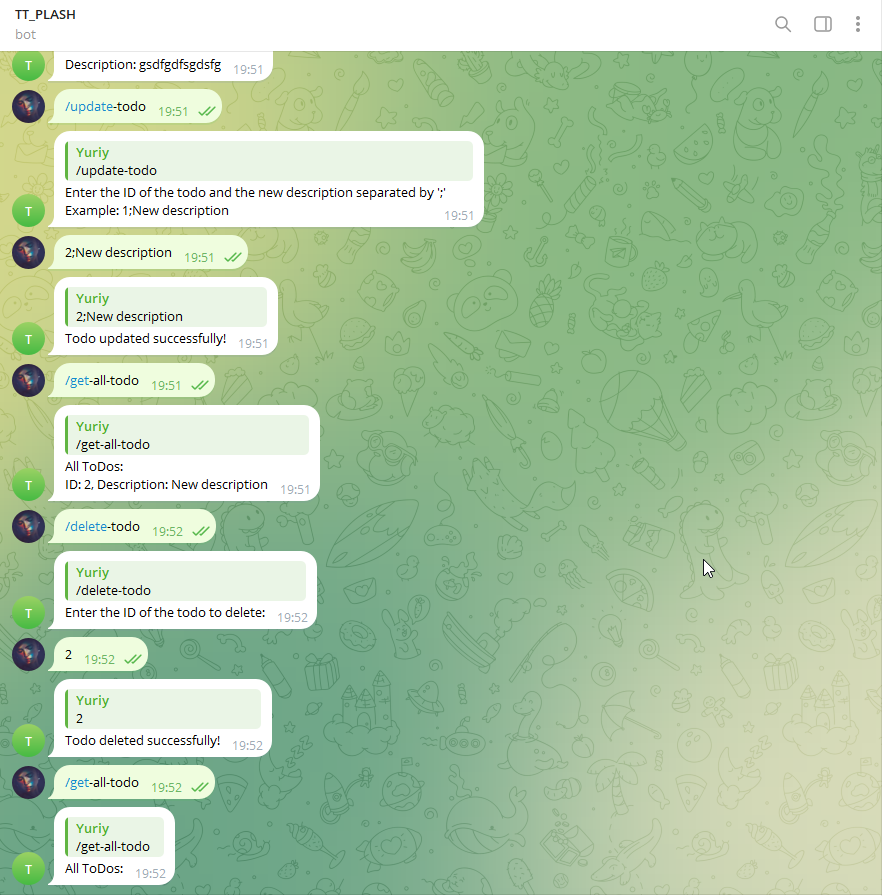

# TT_PLASH

Todo Bot is a Telegram-based task management system that allows users to create, manage, and delete todo lists. The bot is built using the Aiogram framework and interacts with a Django backend API to store and retrieve todo data.

## Technologies Used

- **Python3.11**
- **Django REST Framework**
- **Aiogram**
- **PostgreSQL**
- **Docker / Docker Compose**

## Installation (Docker, Local):
1. Clone the repository
    ```bash
    git clone https://github.com/panicua/TT_PLASH.git
    ```

2. Create an `.env` file in the root of the project directory. You can use the `.env_example` file as a template. Don't forget to replace the placeholders with your own values:
I'll send you main values to change in telegram to save time
   ```sh
   cd TT_PLASH
   cp .env_example .env
   ```

3. Build docker image and start containers (**migrations** are already included in docker-compose.yml):
   ```sh
   docker-compose build
   docker-compose up
   ```

## Documentation
### Start commands:
- /start        -> to get/check an access
- /help         -> to see commands (only works if you got user/admin access)

### Users handling commands (admin only):
- /add-user      -> to add new user and group
- /delete-user   -> to delete user
- /edit-user     -> to edit user group

### Domain commands (user added by an admin):
- /search        -> to check domains availability

### Todo commands (user added by an admin):
- /create-todo   -> to create new todo with description
- /get-all-todo  -> to get all todos with short description and id
- /get-todo      -> to get todo by id
- /update-todo   -> to update todo description by id
- /delete-todo   -> to delete todo by id


## Demo:

